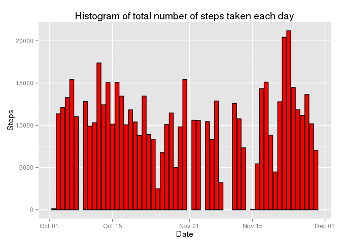
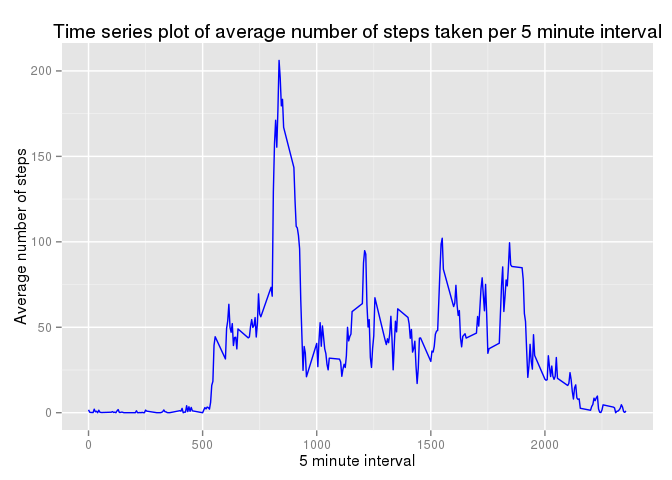
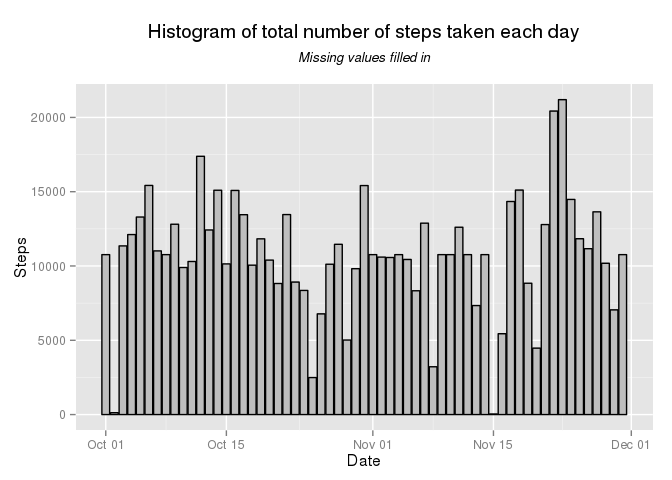
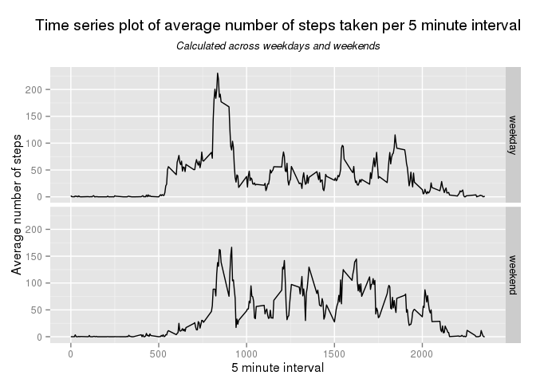

# Reproducible Research: Peer Assessment 1
Vikram Radhakrishnan  
09/07/2014  

## Loading and preprocessing the data
This is the code that is needed to:

1. Load the data
2. Process/transform the data into a format suitable for the analysis


```r
## Check if the csv is available. If not, unzip the zip file.
if(!file.exists("activity.csv")) {
  unzip("activity.zip")
}

## Read in the raw data
raw_data <- read.csv("activity.csv", stringsAsFactors = FALSE)

## Preprocess data - convert dates from characters to Date type
raw_data$date <- as.Date(raw_data$date, "%Y-%m-%d")
```


## What is mean total number of steps taken per day?
For this part of the assignment, the missing values in the dataset are ignored.  
This is the code to:

1. Make a histogram of the total number of steps taken each day
2. Calculate and report the mean and median total number of steps taken per day


```r
## First extract only the readings which have no missing values
complete_data <- raw_data[complete.cases(raw_data), ]

## Get a table of total steps for each date
steps_per_day <- aggregate(complete_data$steps, by = list(complete_data$date), FUN = sum)
names(steps_per_day) <- c("Date", "Steps")

## Plot a histogram of total number of steps taken for each date
library(ggplot2)
plot1 <- ggplot(steps_per_day, aes(Date, Steps)) + geom_bar(stat = "identity", colour = "black", fill = "red") + labs(title = "Histogram of total number of steps taken each day")
print(plot1)
```

 

```r
## Calculate the mean from this data. Ignore missing values.
mean_total_steps <- mean(steps_per_day$Steps, na.rm = TRUE)
print(mean_total_steps)
```

```
## [1] 10766
```

```r
## Calculate the median from this data. Ignore missing values.
median_total_steps <- median(steps_per_day$Steps, na.rm = TRUE)
print(median_total_steps)
```

```
## [1] 10765
```

Mean total number of steps taken per day is: 10766  
Median total number of steps taken per day is: 10765

## What is the average daily activity pattern?
This code does the following:

1. Time series plot (i.e. type = "l") of the 5-minute interval (x-axis) and the average number of steps taken, averaged across all days (y-axis)
2. Find which 5-minute interval, on average across all the days in the dataset, contains the maximum number of steps


```r
## Tabulate the average number of steps taken per 5 minute interval
avg_steps_per_interval <- aggregate(raw_data$steps, by = list(raw_data$interval), FUN = mean, na.rm = TRUE)
names(avg_steps_per_interval) <- c("Interval", "Steps")

## Plot the time series plot
plot2 <- ggplot(avg_steps_per_interval, aes(Interval, Steps)) + geom_line(colour = "blue") + labs(title = "Time series plot of average number of steps taken per 5 minute interval", x = "5 minute interval", y = "Average number of steps")
print(plot2)
```

 

```r
## Extract the interval corresponding to the maximum average number of steps
max_avg_steps <- subset(avg_steps_per_interval, avg_steps_per_interval$Steps == max(avg_steps_per_interval$Steps))
print(max_avg_steps$Interval)
```

```
## [1] 835
```

```r
print(max_avg_steps$Steps)
```

```
## [1] 206.2
```
The maximum average number of steps taken per 5 minute interval is: 206.2  
The 5 minute interval this corresponds to is: 835

## Imputing missing values
This code does the following:

1. Calculate and report the total number of missing values in the dataset (i.e. the total number of rows with NAs)

2. Fill in all of the missing values in the dataset. Missing values are replaced by the mean for that corresponding 5 minute interval.

3. Create a new dataset that is equal to the original dataset but with the missing data filled in.

4. Make a histogram of the total number of steps taken each day and calculate and report the mean and median total number of steps taken per day. Check if these values differ from the estimates from the first part of the assignment. Calculate the impact of imputing missing data on the estimates of the total daily number of steps.


```r
## First calculate the number of rows with missing values
missing_rows <- sum(!complete.cases(raw_data))
print(missing_rows)
```

```
## [1] 2304
```

```r
## Create a new dataset with the missing values filled in
## Strategy - Use the average number of steps from the corresponding 5 minute interval
NA_removed_data <- raw_data
for(i in 1:nrow(raw_data)) {
  if(is.na(NA_removed_data$steps[i])) {             ## Check each row for NA
    this_interval <- NA_removed_data$interval[i]   ## Extract the corresponding 5 minute interval
    replaceNA <- avg_steps_per_interval[avg_steps_per_interval$Interval == this_interval, ]$Steps
    NA_removed_data$steps[i] <- replaceNA  ## Replace the NA with the corresponding average number of steps for that interval
  }
}

## Use this data to calculate the tabulate the total number of steps per day
new_steps_per_day <- aggregate(NA_removed_data$steps, by = list(NA_removed_data$date), FUN = sum)
names(new_steps_per_day) <- c("Date", "Steps")

## Create a histogram of the total number of steps taken each day
library(ggplot2)
plot3 <- ggplot(new_steps_per_day, aes(Date, Steps)) + geom_bar(stat = "identity", colour = "black", fill = "grey") + ggtitle(expression(atop("Histogram of total number of steps taken each day", atop(italic("Missing values filled in"), ""))))
print(plot3)
```

 

```r
## Calculate the mean from this data.
new_mean_total_steps <- mean(new_steps_per_day$Steps)
print(new_mean_total_steps)
```

```
## [1] 10766
```

```r
## Calculate the median from this data.
new_median_total_steps <- median(new_steps_per_day$Steps, na.rm = TRUE)
print(new_median_total_steps)
```

```
## [1] 10766
```

Number of rows with missing values in the dataset: 2304  
Mean total number of steps taken per day (with missing values filled in) is: 10766  
Median total number of steps taken per day (with missing values filled in) is: 10766  
Conclusion: There isn't much of a difference seen when missing values are corrected for using the average number of steps for the corresponding 5 minute interval

## Are there differences in activity patterns between weekdays and weekends?
This code does the following:

1. Create a new factor variable in the dataset with two levels – “weekday” and “weekend” indicating whether a given date is a weekday or weekend day.

2. Make a panel plot containing a time series plot (i.e. type = "l") of the 5-minute interval (x-axis) and the average number of steps taken, averaged across all weekday days or weekend days (y-axis).


```r
## Check if each date in the dataset corresponds to a weekend or a weekday
NA_removed_data$day <- ifelse(weekdays(as.Date(NA_removed_data$date)) %in% c("Saturday", "Sunday"), "weekend", "weekday")
NA_removed_data$day <- as.factor(NA_removed_data$day)

## Tabulate the average number of steps taken per 5 minute interval averaged across weekdays and weekends 
new_avg_steps_per_interval <- aggregate(NA_removed_data$steps, by = list(NA_removed_data$interval, NA_removed_data$day), FUN = mean)
names(new_avg_steps_per_interval) <- c("Interval", "Day", "Steps")

## Plot the time series plot
ggplot(new_avg_steps_per_interval, aes(Interval, Steps, group = Day)) + geom_line(colour = "black") + ggtitle(expression(atop("Time series plot of average number of steps taken per 5 minute interval", atop(italic("Calculated across weekdays and weekends"), ""))))+ labs(x = "5 minute interval", y = "Average number of steps") + facet_grid(Day ~ .)
```

 

Conclusions: There are differences seen in activity patterns between weekdays and weekends
